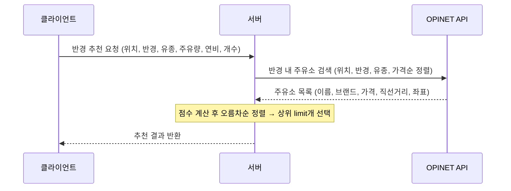
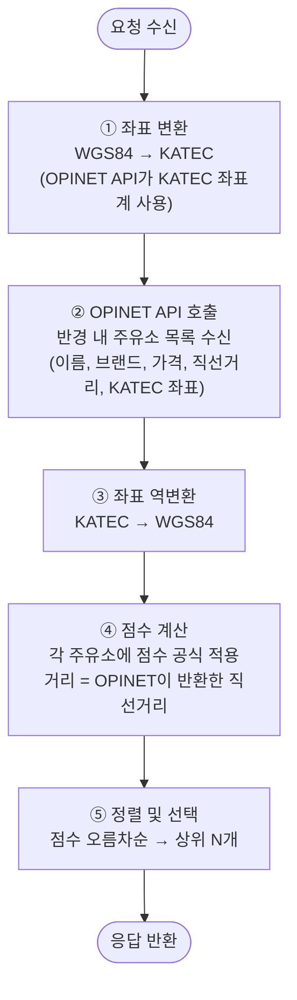
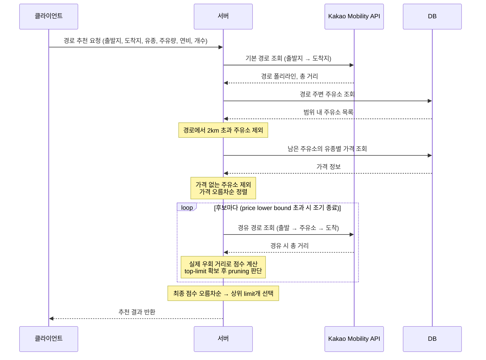

# 주유소 추천 플로우

두 가지 추천 방식을 제공한다: **반경 기반**과 **경로 기반**.

---

## 공통: 점수 공식

두 방식 모두 동일한 공식으로 주유소 점수를 계산한다. **점수가 낮을수록 유리하다.**

$$
\text{score} = \underbrace{\text{가격} \times \text{주유량}}_{\text{주유 비용}} + \underbrace{\dfrac{\text{거리}_{km}}{\text{연비}} \times \text{가격}}_{\text{이동 연료비}}
$$

- **가격**: 해당 주유소의 유종별 가격 (원/L)
- **주유량**: 사용자가 입력한 주유 예정량 (L)
- **거리**: 반경 기반은 직선거리, 경로 기반은 실제 우회 거리 (m → km 변환)
- **연비**: 사용자 차량 연비 (km/L)

---

## 1. 반경 기반 추천

### API

```
GET /api/gas-stations/recommendations/radius
```

| 파라미터 | 타입 | 제약 | 설명 |
|---------|------|------|------|
| latitude | Double | -90 ~ 90 | 현재 위치 위도 (WGS84) |
| longitude | Double | -180 ~ 180 | 현재 위치 경도 (WGS84) |
| radius | Int | 1 ~ 5000 | 탐색 반경 (m) |
| fuelType | Enum | GASOLINE \| DIESEL \| PREMIUM_GASOLINE \| LPG | 유종 |
| refuelLiters | Double | 양수 | 주유 예정량 (L) |
| fuelEfficiency | Double | 양수 | 차량 연비 (km/L) |
| limit | Int | 1 ~ 3 | 추천 개수 (사용자가 받을 결과 수) |

### 시퀀스



### 서버 내부 처리



### 특징

- **외부 API 호출: 1회** (OPINET `/aroundAll.do`)
- OPINET이 이미 가격순 정렬된 결과를 반환하지만, 점수 공식(가격 + 이동비용)으로 재정렬하므로 순위가 바뀔 수 있다
- 거리는 OPINET이 계산한 직선거리이며 실제 도로 거리가 아님

---

## 2. 경로 기반 추천

출발지 → 도착지 경로 상에서 경유 시 **총 비용(주유비 + 우회 연료비)이 최소**인 주유소를 추천한다.

### API

```
GET /api/gas-stations/recommendations/route
```

| 파라미터 | 타입 | 제약 | 설명 |
|---------|------|------|------|
| originLatitude | Double | -90 ~ 90 | 출발지 위도 (WGS84) |
| originLongitude | Double | -180 ~ 180 | 출발지 경도 (WGS84) |
| destinationLatitude | Double | -90 ~ 90 | 도착지 위도 (WGS84) |
| destinationLongitude | Double | -180 ~ 180 | 도착지 경도 (WGS84) |
| fuelType | Enum | GASOLINE \| DIESEL \| PREMIUM_GASOLINE \| LPG | 유종 |
| refuelLiters | Double | 양수 | 주유 예정량 (L) |
| fuelEfficiency | Double | 양수 | 차량 연비 (km/L) |
| limit | Int | 1 ~ 3 | 추천 개수 (사용자가 받을 결과 수) |

### 시퀀스



### 서버 내부 처리

```mermaid
flowchart TD
    A([사용자 요청]) --> B

    B["① 기본 경로 조회<br/>Kakao API: 출발 → 도착<br/>결과: 경로 폴리라인 + 총 거리"]
    B --> C

    C["② 경로 주변 주유소 조회<br/>경로 전체를 감싸는 사각형에<br/>2km 버퍼를 더한 범위로 DB 조회"]
    C --> D

    D{"③ Corridor 필터<br/>각 주유소 ↔ 경로 최단 거리 계산"}
    D -->|경로에서 2km 초과| DISC1[제외]
    D -->|경로에서 2km 이내| E

    E["④ 유종별 가격 조회<br/>남은 주유소 ID로 DB 조회"]
    E --> F

    F{"⑤ 가격 유무 확인"}
    F -->|가격 없음| DISC2[제외]
    F -->|가격 있음| G

    G["⑥ 가격 오름차순 정렬<br/>price lower bound 탐색을 위한 준비"]
    G --> H

    H{"⑦ price lower bound 검사<br/>price × 주유량 > k번째 최선 점수?"}
    H -->|예 (이후 모든 후보 pruning 가능)| J
    H -->|아니오| I

    I["⑧ Kakao 경유 경로 조회<br/>출발 → 주유소 → 도착<br/>실제 우회 거리 = 경유 거리 - 기본 거리<br/>음수이면 0으로 보정<br/>점수 = 주유비 + 실제 우회 연료비"]
    I --> H2["top-limit 확보 시 kth 점수 갱신"]
    H2 --> H

    J["⑨ 최종 정렬 및 선택<br/>점수 오름차순 → 상위 limit개"]
    J --> K([추천 결과 반환])
```

### price lower bound가 보장하는 것

점수 공식에서 우회 거리는 항상 0 이상이므로:

$$
\text{score} = \text{가격} \times \text{주유량} + \underbrace{\dfrac{\text{우회}_{km}}{\text{연비}} \times \text{가격}}_{\geq\ 0}
\ \geq\ \text{가격} \times \text{주유량}
$$

즉 `가격 × 주유량`은 score의 **수학적 하한(lower bound)**이다.

후보를 가격 오름차순으로 탐색하면서 top-limit 결과가 확보된 후, `price × 주유량 > k번째 최선 score`이면 그 이후 모든 후보도 같은 조건을 만족하므로 Kakao API를 호출하지 않고 탐색을 종료할 수 있다.

이 방식은 **최적해(상위 limit개)를 반드시 포함한다**는 수학적 보장을 가지면서, 실제로는 Kakao API 호출을 최소화한다.

### 직선거리 기반 추정을 사용하지 않는 이유

```
폴리라인 바로 옆 200m 주유소라도
해당 구간이 고속도로이면
  → 가장 가까운 나들목이 4km 앞
  → 실제 우회 거리: 8km 이상

직선거리 기반 추정: 400m (왕복)
Kakao 실제 계산:  8,000m 이상
```

직선거리 왕복은 실제 도로 우회 거리의 하한이 아니다. 직선거리 기반 필터로 후보를 줄이면 최적 주유소가 잘려나갈 수 있다.

---

## API 호출 횟수 비교

| | 반경 기반 | 경로 기반 |
|--|---------|---------|
| OPINET | 1회 | 0회 |
| Kakao Directions | 0회 | 1 + N회 (N은 price lower bound pruning에 따라 가변, 최소 limit회) |
| DB 조회 | 0회 | 2회 (주유소, 가격) |

---

## 응답 형식

```json
[
  {
    "opinetStationId": "A0012345",
    "name": "테스트주유소",
    "brand": "SK에너지",
    "latitude": 37.5,
    "longitude": 127.0,
    "price": 1650,
    "distance": 1200.0,
    "score": 67980.0,
    "isActualDetour": true
  }
]
```

| 필드 | 설명 |
|------|------|
| opinetStationId | OPINET 고유 주유소 ID |
| price | 요청 유종 가격 (원/L) |
| distance | 반경 기반: 직선거리(m) / 경로 기반: 실제 우회 거리(m) |
| score | 점수 (낮을수록 유리) |
| isActualDetour | `false`: 직선거리 추정 / `true`: Kakao 실제 도로 거리 |
